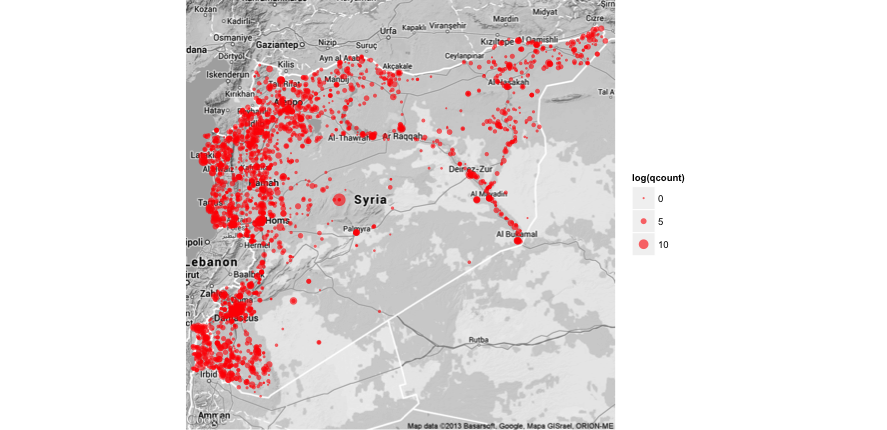

# dplyr-impala 

Experimental code to integrate dplyr with impala 

## Installation 

Build an impala server, currently working with this 

https://github.com/eventdata/hackathon/tree/master/parquet

Create a "poor man's" fat jar from 

https://downloads.cloudera.com/impala-jdbc/impala-jdbc-0.5-2.zip

Unzip all the jar files, making sure hive-jdbc is last

    unzip -o commons-logging-1.0.4.jar 
    unzip -o hive-metastore-0.10.0-cdh4.2.0.jar 
    unzip -o hive-service-0.10.0-cdh4.2.0.jar 
    unzip -o libfb303-0.9.0.jar 
    unzip -o libthrift-0.9.0.jar 
    unzip -o log4j-1.2.16.jar 
    unzip -o slf4j-api-1.6.4.jar 
    unzip -o slf4j-log4j12-1.6.1.jar 
    unzip -o hive-jdbc-0.10.0-cdh4.2.0.jar
    rm *.jar 
    zip -r impala-jdbc-0.0.1.jar *

Forward socket connection to impala 

    ssh -L 21050:localhost:21050 -i $FCL_KEYPATH ubuntu@$FCL_HOST

Run RStudio and install RJDBC

`install.packages("RJDBC")`

`library(RJDBC)`

`drv <- JDBC("org.apache.hive.jdbc.HiveDriver", "/opt/jars/impala-jdbc-0.0.1.jar","'")`

`conn <- dbConnect(drv, "jdbc:hive2://localhost:21050/;auth=noSasl")`

`dbListTables(conn)`

`dbGetQuery(conn, "select year, count(year) from gdelt group by year order by count(year) desc limit 10")`

    year count(year)
    1  2012    34446073
    2  2011    31501556
    3  2009    23464598
    4  2010    22502301
    5  2013    21591107
    6  2008    14331021
    7  2007    11243098
    8  2006     6345731
    9  2003     5529024
    10 2001     4995943

`system.time(dbGetQuery(conn, "select year, count(year) from gdelt group by year order by count(year) desc limit 10"))`

    user  system elapsed 
    0.015   0.005   8.819 

## ggplot2 and ggmap

Some modifications from this example 

http://gdeltblog.wordpress.com/2013/08/29/subsetting-and-aggregating-gdelt-using-dplyr-and-sqlite/

    library(ggplot2)
    library(ggmap)
    library(RJDBC)

    drv <- JDBC("org.apache.hive.jdbc.HiveDriver", "/opt/jars/impala-jdbc-0.0.1.jar","'")
    conn <- dbConnect(drv, "jdbc:hive2://localhost:21050/;auth=noSasl")
    dbListTables(conn)

    syria <- dbGetQuery(conn, "SELECT ActionGeo_FullName, ActionGeo_long, ActionGeo_Lat, count(*) as qcount  FROM gdelt WHERE ActionGeo_CountryCode = 'SY' GROUP BY ActionGeo_FullName, ActionGeo_Lat, ActionGeo_Long")

    syria.map + geom_point(data = syria, aes(x = actiongeo_long, y = actiongeo_lat, size = log(qcount)), color = "red", alpha = 0.6)

## TODO

Integrate export of rda files from queries 

    # Get a subset of data from impala engine 
    save(foo, file="foo.rda", compress='xz')
    
Be able to export sql lite files ???

