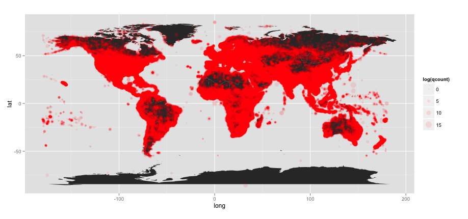

# dplyr-impala 

Experimental code to integrate dplyr with impala 

## Installation 

Build an impala server, currently working with this 

https://github.com/eventdata/hackathon/tree/master/parquet

Create a "poor man's" fat jar from 

https://downloads.cloudera.com/impala-jdbc/impala-jdbc-0.5-2.zip

Unzip all the jar files, making sure hive-jdbc is last

    unzip -o commons-logging-1.0.4.jar 
    unzip -o hive-metastore-0.10.0-cdh4.2.0.jar 
    unzip -o hive-service-0.10.0-cdh4.2.0.jar 
    unzip -o libfb303-0.9.0.jar 
    unzip -o libthrift-0.9.0.jar 
    unzip -o log4j-1.2.16.jar 
    unzip -o slf4j-api-1.6.4.jar 
    unzip -o slf4j-log4j12-1.6.1.jar 
    unzip -o hive-jdbc-0.10.0-cdh4.2.0.jar
    rm *.jar 
    zip -r impala-jdbc-0.0.1.jar *

Forward socket connection to impala 

    ssh -L 21050:localhost:21050 -i $FCL_KEYPATH ubuntu@$FCL_HOST

Run RStudio and install RJDBC

`install.packages("RJDBC")`

`library(RJDBC)`

`drv <- JDBC("org.apache.hive.jdbc.HiveDriver", "/opt/jars/impala-jdbc-0.0.1.jar","'")`

`conn <- dbConnect(drv, "jdbc:hive2://localhost:21050/;auth=noSasl")`

`dbListTables(conn)`

`dbGetQuery(conn, "select year, count(year) from gdelt group by year order by count(year) desc limit 10")`

    year count(year)
    1  2012    34446073
    2  2011    31501556
    3  2009    23464598
    4  2010    22502301
    5  2013    21591107
    6  2008    14331021
    7  2007    11243098
    8  2006     6345731
    9  2003     5529024
    10 2001     4995943

`system.time(dbGetQuery(conn, "select year, count(year) from gdelt group by year order by count(year) desc limit 10"))`

    user  system elapsed 
    0.015   0.005   8.819 

## ggplot2 and ggmap

Some modifications from this example 

http://gdeltblog.wordpress.com/2013/08/29/subsetting-and-aggregating-gdelt-using-dplyr-and-sqlite/

    library(ggplot2)
    library(ggmap)
    library(RJDBC)

    drv <- JDBC("org.apache.hive.jdbc.HiveDriver", "/opt/jars/impala-jdbc-0.0.1.jar","'")
    conn <- dbConnect(drv, "jdbc:hive2://localhost:21050/;auth=noSasl")
    dbListTables(conn)

    syria.map <- qmap(location = "syria", maptype = "terrain", color = "bw", zoom = 7)

    syria <- dbGetQuery(conn, "SELECT ActionGeo_FullName, ActionGeo_long, ActionGeo_Lat, count(*) as qcount  FROM gdelt WHERE ActionGeo_CountryCode = 'SY' GROUP BY ActionGeo_FullName, ActionGeo_Lat, ActionGeo_Long")

    

    syria.map + geom_point(data = syria, aes(x = actiongeo_long, y = actiongeo_lat, size = log(qcount)), color = "red", alpha = 0.6)

For fun query the density of all of the GDELT for the whole world. Need to do 
manual steps here because there is a bug somewhere in the driver when running it from within R, need to investigate more. Query only takes 32 seconds.

    ubuntu$ impala-shell -i localhost -f query.sql --print_header -B > foo.tsv

    Starting Impala Shell in unsecure mode
    Connected to localhost:21000
    Server version: impalad version 1.1.1 RELEASE (build 83d5868f005966883a918a819a449f636a5b3d5f)
    Query: select ActionGeo_FullName,
           ActionGeo_long,
           ActionGeo_Lat,
           count(*) as qcount
    FROM gdelt
    GROUP BY ActionGeo_FullName,
             ActionGeo_Lat,
             ActionGeo_Long
    Query finished, fetching results ...

    Returned 611179 row(s) in 32.65s

Remove the place name column 

    cut -f2- foo.tsv > foo2.tsv

Copy to local machine

         
    # foo2 <- read.delim("~/project/funnelcloud/clouds/gdelt/foo2.tsv",stringsAsFactors=F)

    foo2 <- read.delim("~/project/funnelcloud/clouds/gdelt/foo2.tsv",colClasses=c("numeric","numeric","numeric"), na.string='NULL')

    # remove stray nulls
    foo2 <- na.omit(foo2)

    
    # Null Island comes up many times, removing so it doesn't skew rendering
  
    foo2[foo2$qcount==5741734,]
           actiongeo_long actiongeo_lat  qcount 
    313249              0             0 5741734

    foo2 <- foo2[foo2$qcount != 5741734,]

    # What location is this ?

    foo2[foo2$qcount == 5580651,]

           actiongeo_long actiongeo_lat  qcount
    596413            -97            38 5580651
    
    # removing...

    foo2 <- foo2[foo2$qcount != 5580651,]

    ggplot(foo2, aes(x=qcount)) + geom_histogram(binwidth=0.1) + scale_x_log10()
    

    

    require(ggplot2)
    require(maps)
    world <- map_data("world")
    p <- ggplot() + coord_fixed()
    base <- p + geom_polygon(data=world, aes(x=long, y=lat, group=group))
    base +  geom_point(data = foo2, aes(x = actiongeo_long, y = actiongeo_lat, size = log(qcount)), color = "red", alpha = 0.1)

    # Needs work, but you can adjust from here

    

## TODO

Integrate export of rda files from queries 

    # Get a subset of data from impala engine 
    save(foo, file="foo.rda", compress='xz')
    
Be able to export sql lite files ???

